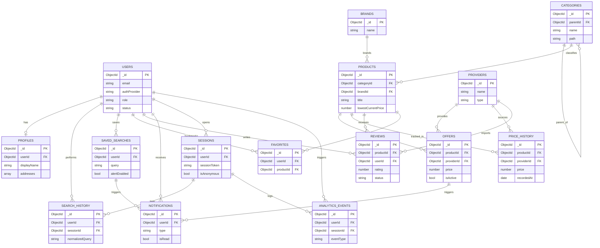

# NexCart (BuyWise) — Database Architecture

**Phase:** 5.1 — Database Architecture Design
**Status:** Design only. No database implemented, no SQL, no Prisma schema.
**Target engine:** MongoDB (document store), matching the existing Next.js 14 / TypeScript / MongoDB / Tailwind stack.

---

## 0. Design Principles

Since NexCart is a document database (MongoDB), "Primary Key" and "Foreign Key" don't mean the same thing they do in an RDBMS. To keep this doc precise:

- **Primary Key** = `_id` (BSON `ObjectId`), auto-generated unless stated otherwise.
- **Foreign Key** = a field storing another document's `_id` (a *reference*, not an enforced constraint). Referential integrity is enforced at the application/service layer, not the database engine.
- **Embedded vs Referenced**: High-cardinality, independently-queried data (Products, Offers, Reviews) is **referenced**. Low-cardinality data that's always read together with its parent (Addresses inside a Profile, filters inside a SavedSearch) is **embedded** as a sub-document.
- **Polymorphic scale entities** (SearchHistory, AnalyticsEvents, PriceHistory) are designed as append-heavy, time-series-like collections with TTL/retention indexes to bound growth.
- **Anonymous/guest support**: Users, SearchHistory, Favorites-adjacent flows, and AnalyticsEvents all support a `sessionId`-only path (no `userId`) since a commerce aggregator gets significant pre-signup traffic.

---

## 1. Users

**Purpose:** Canonical identity + authentication record. Deliberately kept thin — no display/profile data lives here, so auth reads stay cheap and this collection can be locked down with stricter access controls.

| Field | Type | Notes |
|---|---|---|
| `_id` | ObjectId | **Primary Key** |
| `email` | String | Unique, lowercase-normalized |
| `passwordHash` | String \| null | Null if OAuth-only account |
| `authProvider` | Enum(`local`,`google`,`github`) | |
| `providerAccountId` | String \| null | External OAuth subject id |
| `role` | Enum(`user`,`admin`,`moderator`) | Default `user` |
| `status` | Enum(`active`,`suspended`,`deleted`) | Soft-delete flag |
| `emailVerified` | Boolean | |
| `mfaEnabled` | Boolean | |
| `createdAt` | Date | |
| `updatedAt` | Date | |
| `lastLoginAt` | Date \| null | |

**Foreign Keys:** none (root entity).

**Relationships:**
- 1:1 → Profiles
- 1:N → SearchHistory, SavedSearches, Favorites, Reviews, Notifications, Sessions, AnalyticsEvents

**Suggested Indexes:**
- Unique index on `email`
- Compound unique index on `(authProvider, providerAccountId)` (sparse, since local accounts have null)
- Index on `status` (for admin/moderation queries)

---

## 2. Profiles

**Purpose:** Extended, mutable user data — kept separate from `Users` so that high-frequency auth checks don't load addresses/preferences, and so profile writes don't touch the security-sensitive `Users` document.

| Field | Type | Notes |
|---|---|---|
| `_id` | ObjectId | **Primary Key** |
| `userId` | ObjectId | **Foreign Key → Users._id**, unique (1:1) |
| `displayName` | String | |
| `avatarUrl` | String \| null | |
| `phone` | String \| null | E.164 format |
| `dateOfBirth` | Date \| null | |
| `gender` | Enum(`male`,`female`,`other`,`undisclosed`) \| null | |
| `addresses` | Array\<Embedded Address\> | `{ label, line1, line2, city, state, pincode, country, isDefault }` |
| `preferences` | Embedded | `{ preferredCategoryIds: [ObjectId], preferredProviderIds: [ObjectId], currency, language, notifyOnPriceDrop: Boolean }` |
| `createdAt` | Date | |
| `updatedAt` | Date | |

**Foreign Keys:** `userId → Users._id`

**Relationships:** 1:1 with Users.

**Suggested Indexes:**
- Unique index on `userId`
- Optional index on `preferences.preferredCategoryIds` (multikey) for recommendation queries

---

## 3. Search History

**Purpose:** Raw log of every search query (logged-in or anonymous) — powers personalization, trending searches, and "recently searched" UI.

| Field | Type | Notes |
|---|---|---|
| `_id` | ObjectId | **Primary Key** |
| `userId` | ObjectId \| null | **Foreign Key → Users._id** (null = anonymous) |
| `sessionId` | ObjectId | **Foreign Key → Sessions._id** (always present) |
| `rawQuery` | String | As typed by user |
| `normalizedQuery` | String | Lowercased, trimmed, stopword-stripped |
| `filters` | Embedded | `{ categoryId, minPrice, maxPrice, providerIds: [ObjectId] }` |
| `resultCount` | Number | |
| `device` | String | `mobile` / `desktop` / `app` |
| `createdAt` | Date | |

**Foreign Keys:** `userId → Users._id`, `sessionId → Sessions._id`

**Relationships:** N:1 → Users, N:1 → Sessions.

**Suggested Indexes:**
- Compound `(userId, createdAt DESC)` — "my recent searches"
- Text index on `normalizedQuery` — trending/autocomplete
- TTL index on `createdAt` (e.g. 180 days) to bound collection growth

---

## 4. Saved Searches

**Purpose:** A user explicitly saves a query + filter set to get alerted later (e.g. "notify me when Sony WH-1000XM5 drops below ₹20,000").

| Field | Type | Notes |
|---|---|---|
| `_id` | ObjectId | **Primary Key** |
| `userId` | ObjectId | **Foreign Key → Users._id** |
| `name` | String | User-facing label |
| `query` | String | |
| `filters` | Embedded | Same shape as SearchHistory.filters, plus `targetPrice: Number \| null` |
| `alertEnabled` | Boolean | |
| `alertFrequency` | Enum(`instant`,`daily`,`weekly`) | |
| `lastNotifiedAt` | Date \| null | |
| `createdAt` | Date | |
| `updatedAt` | Date | |

**Foreign Keys:** `userId → Users._id`

**Relationships:** N:1 → Users. 1:N → Notifications (a matching alert spawns a Notification).

**Suggested Indexes:**
- Index on `userId`
- Compound `(alertEnabled, alertFrequency)` — used by the background alert-matching job
- Unique compound `(userId, query, filters-hash)` to prevent duplicate saved searches (hash computed at write time)

---

## 5. Favorites

**Purpose:** User-bookmarked products (wishlist / heart icon).

| Field | Type | Notes |
|---|---|---|
| `_id` | ObjectId | **Primary Key** |
| `userId` | ObjectId | **Foreign Key → Users._id** |
| `productId` | ObjectId | **Foreign Key → Products._id** |
| `priceAtSave` | Number | Snapshot price for "price changed since you saved" UI |
| `notes` | String \| null | |
| `createdAt` | Date | |

**Foreign Keys:** `userId → Users._id`, `productId → Products._id`

**Relationships:** N:1 → Users, N:1 → Products. Many-to-many between Users and Products, realized as this junction collection.

**Suggested Indexes:**
- Unique compound `(userId, productId)` — prevents duplicate favorites
- Index on `userId` (list a user's favorites)
- Index on `productId` (e.g. "N users favorited this" analytics)

---

## 6. Products

**Purpose:** Canonical, de-duplicated product record — the aggregation target that multiple `Offers` (one per provider) attach to. This is the entity search/browse/detail pages are built around.

| Field | Type | Notes |
|---|---|---|
| `_id` | ObjectId | **Primary Key** |
| `title` | String | Canonical/normalized title |
| `description` | String | |
| `categoryId` | ObjectId | **Foreign Key → Categories._id** |
| `brandId` | ObjectId \| null | **Foreign Key → Brands._id** |
| `images` | Array\<String\> | CDN URLs |
| `attributes` | Embedded (Map) | Free-form specs, e.g. `{ ram: "16GB", color: "black" }` |
| `slug` | String | URL-friendly, unique |
| `avgRating` | Number | Denormalized from Reviews for fast list rendering |
| `ratingCount` | Number | Denormalized |
| `lowestCurrentPrice` | Number | Denormalized from active Offers, refreshed by a job |
| `status` | Enum(`active`,`inactive`,`archived`) | |
| `createdAt` | Date | |
| `updatedAt` | Date | |

**Foreign Keys:** `categoryId → Categories._id`, `brandId → Brands._id`

**Relationships:**
- N:1 → Categories, N:1 → Brands
- 1:N → Offers, PriceHistory, Reviews, Favorites

**Suggested Indexes:**
- Unique index on `slug`
- Text index on `(title, description)` — search
- Index on `categoryId`, index on `brandId`
- Index on `lowestCurrentPrice` — sort-by-price queries
- Compound `(categoryId, lowestCurrentPrice)` — category browse + price sort

---

## 7. Providers

**Purpose:** The external services NexCart aggregates across — e-commerce (Amazon, Flipkart), quick commerce (Zepto, Blinkit), food delivery (Swiggy, Zomato), travel (MakeMyTrip), etc. Drives which `Offers` are trusted, how often they're scraped/synced, and commission logic.

| Field | Type | Notes |
|---|---|---|
| `_id` | ObjectId | **Primary Key** |
| `name` | String | Unique |
| `slug` | String | Unique |
| `type` | Enum(`ecommerce`,`quick_commerce`,`food_delivery`,`travel`,`other`) | |
| `logoUrl` | String | |
| `baseUrl` | String | |
| `apiConfig` | Embedded | `{ authType, credentialRef, rateLimitPerMin }` — `credentialRef` points to a secrets manager, never raw secrets |
| `commissionRate` | Number \| null | Affiliate commission % if applicable |
| `syncStatus` | Enum(`active`,`paused`,`error`) | |
| `lastSyncedAt` | Date \| null | |
| `status` | Enum(`active`,`inactive`) | |
| `createdAt` | Date | |
| `updatedAt` | Date | |

**Foreign Keys:** none (root entity).

**Relationships:** 1:N → Offers, PriceHistory.

**Suggested Indexes:**
- Unique index on `name`, unique index on `slug`
- Index on `type` (filter by vertical)
- Index on `syncStatus` (ops dashboard / job scheduling)

---

## 8. Categories

**Purpose:** Hierarchical product taxonomy (e.g. Electronics → Mobiles → Smartphones).

| Field | Type | Notes |
|---|---|---|
| `_id` | ObjectId | **Primary Key** |
| `name` | String | |
| `slug` | String | Unique |
| `parentId` | ObjectId \| null | **Foreign Key → Categories._id** (self-reference) |
| `level` | Number | 0 = root, denormalized for fast tree queries |
| `path` | String | Materialized path, e.g. `/electronics/mobiles/smartphones`, for cheap subtree queries |
| `icon` | String \| null | |
| `createdAt` | Date | |
| `updatedAt` | Date | |

**Foreign Keys:** `parentId → Categories._id` (self-referencing)

**Relationships:** Self-referencing tree (1:N parent→children). 1:N → Products.

**Suggested Indexes:**
- Unique index on `slug`
- Index on `parentId`
- Index on `path` (prefix queries for subtree fetch)

---

## 9. Brands

**Purpose:** Brand master data, deduplicated across providers (e.g. "Samsung" should be one Brand even though Amazon and Flipkart both list it).

| Field | Type | Notes |
|---|---|---|
| `_id` | ObjectId | **Primary Key** |
| `name` | String | |
| `slug` | String | Unique |
| `logoUrl` | String \| null | |
| `description` | String \| null | |
| `createdAt` | Date | |
| `updatedAt` | Date | |

**Foreign Keys:** none (root entity).

**Relationships:** 1:N → Products.

**Suggested Indexes:**
- Unique index on `slug`
- Text index on `name` (brand search/autocomplete)

---

## 10. Offers

**Purpose:** The core aggregation record — one document per (Product, Provider) pair, holding live price/availability. This is what "compare prices across Amazon, Flipkart, Zepto..." is built on.

| Field | Type | Notes |
|---|---|---|
| `_id` | ObjectId | **Primary Key** |
| `productId` | ObjectId | **Foreign Key → Products._id** |
| `providerId` | ObjectId | **Foreign Key → Providers._id** |
| `providerProductUrl` | String | Deep link / affiliate link |
| `providerSku` | String \| null | Provider's own product/listing id |
| `price` | Number | Current selling price |
| `mrp` | Number | List price |
| `discountPercent` | Number | Derived at write time |
| `currency` | String | ISO 4217, default `INR` |
| `couponCode` | String \| null | |
| `stockStatus` | Enum(`in_stock`,`out_of_stock`,`limited`,`unknown`) | |
| `deliveryEtaMinutes` | Number \| null | Relevant for quick-commerce/food |
| `offerStartAt` | Date \| null | |
| `offerEndAt` | Date \| null | |
| `lastScrapedAt` | Date | Freshness marker |
| `isActive` | Boolean | |
| `createdAt` | Date | |
| `updatedAt` | Date | |

**Foreign Keys:** `productId → Products._id`, `providerId → Providers._id`

**Relationships:** N:1 → Products, N:1 → Providers. Each write/update also emits a snapshot into `PriceHistory`.

**Suggested Indexes:**
- Unique compound `(productId, providerId)` — one active offer per provider per product
- Compound `(productId, isActive, price ASC)` — "cheapest active offer for this product"
- Index on `lastScrapedAt` (staleness/ops monitoring)
- Compound `(providerId, isActive)`

---

## 11. Price History

**Purpose:** Append-only time-series snapshot of `(Product, Provider)` price, used for trend charts and to power SavedSearches price-drop alerts.

| Field | Type | Notes |
|---|---|---|
| `_id` | ObjectId | **Primary Key** |
| `productId` | ObjectId | **Foreign Key → Products._id** |
| `providerId` | ObjectId | **Foreign Key → Providers._id** |
| `price` | Number | |
| `mrp` | Number | |
| `stockStatus` | Enum(`in_stock`,`out_of_stock`,`limited`,`unknown`) | |
| `recordedAt` | Date | |

**Foreign Keys:** `productId → Products._id`, `providerId → Providers._id`

**Relationships:** N:1 → Products, N:1 → Providers. Logically 1:N from Offers (each Offer update writes one history row), though not FK-linked directly to a specific Offer document to keep history durable even if the Offer is deleted.

**Suggested Indexes:**
- Compound `(productId, providerId, recordedAt DESC)` — primary access pattern (chart rendering)
- TTL/retention index on `recordedAt` (e.g. 365 days), or archive to cold storage beyond that window
- Consider MongoDB Time Series Collection type for this entity given its append-only, time-bucketed nature

---

## 12. Reviews

**Purpose:** Product reviews — either authored natively on NexCart, or imported/aggregated from provider platforms for display.

| Field | Type | Notes |
|---|---|---|
| `_id` | ObjectId | **Primary Key** |
| `productId` | ObjectId | **Foreign Key → Products._id** |
| `userId` | ObjectId \| null | **Foreign Key → Users._id** (null if `source = imported`) |
| `source` | Enum(`internal`,`imported`) | |
| `sourceProviderId` | ObjectId \| null | **Foreign Key → Providers._id**, set when `source = imported` |
| `rating` | Number | 1–5 |
| `title` | String \| null | |
| `body` | String | |
| `images` | Array\<String\> | |
| `helpfulCount` | Number | |
| `status` | Enum(`pending`,`approved`,`rejected`) | Moderation state, internal reviews only |
| `createdAt` | Date | |
| `updatedAt` | Date | |

**Foreign Keys:** `productId → Products._id`, `userId → Users._id`, `sourceProviderId → Providers._id`

**Relationships:** N:1 → Products, N:1 → Users (optional), N:1 → Providers (optional).

**Suggested Indexes:**
- Compound `(productId, status, createdAt DESC)` — product page review feed
- Index on `userId` — "my reviews"
- Index on `rating` (for rating-distribution aggregation)

---

## 13. Notifications

**Purpose:** User-facing alerts — price drops, saved search matches, offer expiry, system messages.

| Field | Type | Notes |
|---|---|---|
| `_id` | ObjectId | **Primary Key** |
| `userId` | ObjectId | **Foreign Key → Users._id** |
| `type` | Enum(`price_drop`,`saved_search_match`,`offer_expiry`,`system`,`review_reply`) | |
| `title` | String | |
| `body` | String | |
| `payload` | Embedded | `{ productId, offerId, savedSearchId }` — sparse, only relevant fields populated |
| `channel` | Enum(`in_app`,`email`,`push`) | |
| `isRead` | Boolean | |
| `sentAt` | Date \| null | |
| `createdAt` | Date | |

**Foreign Keys:** `userId → Users._id`; `payload.productId → Products._id`, `payload.offerId → Offers._id`, `payload.savedSearchId → SavedSearches._id` (all optional, polymorphic-ish payload)

**Relationships:** N:1 → Users. Loosely N:1 → Products / Offers / SavedSearches via `payload`.

**Suggested Indexes:**
- Compound `(userId, isRead, createdAt DESC)` — notification inbox / unread count
- TTL index on `createdAt` for read notifications (e.g. auto-purge after 90 days) — implemented as a partial TTL index where `isRead: true`

---

## 14. Analytics Events

**Purpose:** Generic, high-volume event stream for product/business analytics — views, clicks, conversions, funnel tracking. Deliberately schema-light (`metadata` as a flexible map) so new event types don't require migrations.

| Field | Type | Notes |
|---|---|---|
| `_id` | ObjectId | **Primary Key** |
| `userId` | ObjectId \| null | **Foreign Key → Users._id** (null = anonymous) |
| `sessionId` | ObjectId | **Foreign Key → Sessions._id** |
| `eventType` | Enum(`page_view`,`product_view`,`search`,`click_offer`,`add_favorite`,`purchase_redirect`) | |
| `entityType` | String \| null | e.g. `"Product"`, `"Offer"` |
| `entityId` | ObjectId \| null | Polymorphic reference, resolved via `entityType` |
| `metadata` | Embedded (Map) | Free-form event payload |
| `deviceInfo` | Embedded | `{ device, os, browser }` |
| `createdAt` | Date | |

**Foreign Keys:** `userId → Users._id`, `sessionId → Sessions._id`, `entityId → (polymorphic, resolved by entityType)`

**Relationships:** N:1 → Users (optional), N:1 → Sessions, polymorphic N:1 → Products/Offers/etc.

**Suggested Indexes:**
- Compound `(eventType, createdAt DESC)` — funnel/dashboard queries
- Compound `(userId, createdAt DESC)`
- Compound `(entityType, entityId, createdAt DESC)` — "all events for this product"
- TTL index on `createdAt` (e.g. 365 days) or route to a data warehouse beyond that window — this collection should not live forever in the primary operational DB

---

## 15. Sessions

**Purpose:** Auth/device session tracking (refresh tokens, guest sessions for anonymous analytics continuity).

| Field | Type | Notes |
|---|---|---|
| `_id` | ObjectId | **Primary Key** |
| `userId` | ObjectId \| null | **Foreign Key → Users._id** (null = anonymous/guest session) |
| `sessionToken` | String | Unique, opaque token stored client-side |
| `refreshTokenHash` | String \| null | Hashed, never plaintext |
| `isAnonymous` | Boolean | |
| `ipAddress` | String | |
| `userAgent` | String | |
| `device` | String | |
| `expiresAt` | Date | |
| `createdAt` | Date | |
| `lastActiveAt` | Date | |

**Foreign Keys:** `userId → Users._id`

**Relationships:** N:1 → Users (optional). 1:N → SearchHistory, AnalyticsEvents.

**Suggested Indexes:**
- Unique index on `sessionToken`
- Index on `userId`
- TTL index on `expiresAt` — auto-cleanup of expired sessions

---

## 16. Entity-Relationship Diagram

---

## 17. Cross-Cutting Notes for Implementation Phase (5.2+)

These are things to decide when this design gets implemented — not part of this design deliverable, but flagged so they aren't lost:

- **Denormalization tradeoffs**: `Products.lowestCurrentPrice`, `avgRating`, and `ratingCount` are denormalized for read performance. These need a background job (or change-stream trigger) to stay in sync whenever `Offers` or `Reviews` change — classic eventual-consistency tradeoff in a document DB.
- **Time-series collections**: `PriceHistory` and `AnalyticsEvents` are strong candidates for MongoDB's native Time Series Collection type rather than plain collections, given their append-only, time-bucketed access pattern.
- **Data retention**: `SearchHistory`, `AnalyticsEvents`, and read `Notifications` should not grow unbounded — TTL indexes or a scheduled archive-to-cold-storage job are recommended.
- **Sharding (future scale)**: If/when this needs to shard, `Offers` and `PriceHistory` are the highest-write-volume collections and are natural shard-key candidates on `productId` (co-locates a product's offers/history on the same shard for fast reads).
- **Security boundary**: `Users.passwordHash` and `Providers.apiConfig.credentialRef` should never be returned by any read path by default — enforce via projection at the data-access layer, not just at the API layer.
