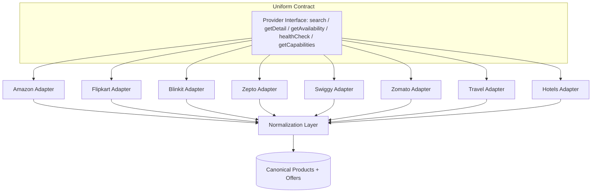
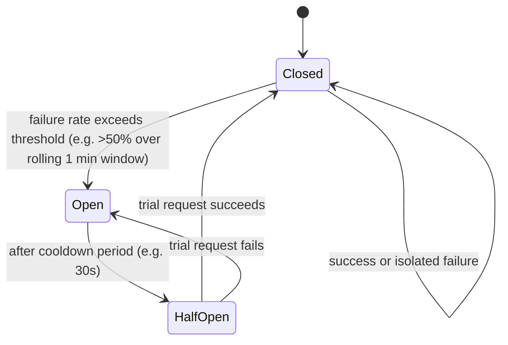

# NexCart (BuyWise) — Provider Integration Architecture

**Phase:** 5.4 — Provider Architecture Design
**Status:** Design/documentation only. No provider API implementation included.
**Depends on:** `docs/database.md` (§7 Providers, §10 Offers), `docs/search-engine.md` (§2.5 Provider Selection, §2.6 Provider Execution)

**Current provider roster (8, across 4 verticals):**

| Vertical | Providers |
|---|---|
| E-commerce | Amazon, Flipkart |
| Quick Commerce | Blinkit, Zepto |
| Food Delivery | Swiggy, Zomato |
| Travel | Travel (flights/trains/cabs aggregator), Hotels |

The central design challenge: these 8 providers have wildly different APIs, auth models, data freshness needs, and failure modes — but the rest of NexCart (Search Orchestrator, Ranking, UI) must never have to know that. Everything below exists to enforce **one uniform contract at the boundary**, so provider #9 can be added without touching a single line outside this layer.

---

## 1. Provider Interface

**Purpose:** A single abstract contract every provider adapter must implement, regardless of vertical. This is the seam that makes the whole system pluggable.

### 1.1 Required capabilities (conceptual, not code)

Every provider adapter must expose:

| Capability | Description |
|---|---|
| `search(query, filters)` | Given a normalized internal query, return raw provider-shaped results |
| `getProductDetail(providerSku)` | Fetch a single listing's full detail (used for detail-page refresh/on-demand freshness) |
| `getAvailability(providerSku)` | Lightweight stock/ETA check, called more frequently than full search |
| `healthCheck()` | Cheap ping used by the Health Monitoring layer (§7) — must respond in <500ms |
| `getCapabilities()` | Static metadata: which filters this provider supports (price range? category? delivery ETA?), so Provider Selection (search-engine.md §2.5) doesn't send filters a provider can't honor |

### 1.2 Interface-level guarantees

- Every adapter returns data in a **provider-raw shape** — normalization into canonical `Products`/`Offers` happens one layer up (§3), never inside the adapter itself. This keeps adapters dumb and swappable.
- Every adapter call is **wrapped uniformly** by the orchestration layer with the same timeout, retry, and circuit-breaker logic (§5, §8) — an adapter cannot opt out of these, preventing one poorly-behaved integration from needing special-cased handling elsewhere.
- Adapters declare their **vertical type** (`ecommerce` \| `quick_commerce` \| `food_delivery` \| `travel`) as static metadata — this drives which filters/UI apply and feeds Provider Selection's category-based routing.

### 1.3 Provider Interface — component diagram

---

## 2. Authentication Strategy

Different providers require fundamentally different auth models — this must be handled per-adapter, but stored/rotated through one shared mechanism.

| Provider | Likely auth model | Notes |
|---|---|---|
| Amazon | Affiliate/Partner API (PA-API) — signed requests (access key + secret key) | Signature-based, request-level, not session-based |
| Flipkart | Affiliate API — API key + affiliate ID in headers | Simpler key-based auth |
| Blinkit | Partner API key, or authenticated scraping session if no public partner API exists | Fallback path needed if formal partnership isn't available |
| Zepto | Same pattern as Blinkit | Quick-commerce partner APIs are less standardized than e-commerce |
| Swiggy | Partner/API key, city-scoped tokens likely required | Food delivery availability is hyper-local — auth may be tied to serviceable-area context |
| Zomato | Partner API key | Similar to Swiggy |
| Travel | OAuth2 client-credentials flow typical of GDS/travel aggregators | Token refresh cadence differs from simple API keys |
| Hotels | OAuth2 or API key depending on the specific aggregator (Booking.com-style partner APIs) | |

### 2.1 Shared credential management principles

- **All credentials are referenced, never inlined.** Per `docs/database.md` §7, `Providers.apiConfig.credentialRef` points to a secrets manager entry — the actual key/secret never lives in the `Providers` document or in application logs.
- **Per-provider auth strategy is pluggable**, described as an enum on the Provider record: `api_key` \| `signed_request` \| `oauth2_client_credentials` \| `scraped_session`. The adapter reads this to know which auth flow to run — the orchestration layer above doesn't need to know the difference.
- **Token refresh is the adapter's responsibility, hidden from callers.** An OAuth2-based adapter (Travel, Hotels) manages its own token lifecycle internally and transparently re-authenticates before expiry; a caller of `search()` never sees an auth-expiry error under normal operation.
- **Scraped-session providers get a dedicated fallback lane.** If Blinkit/Zepto don't have a stable partner API, the adapter behind that `scraped_session` strategy is isolated so a scraping breakage (site redesign, anti-bot change) only fails that one provider's health check — never cascades.

---

## 3. Normalization

**Purpose:** Convert each provider's raw response shape into NexCart's canonical `Products` + `Offers` model (per `docs/database.md` §6/§10), the same responsibility already described at pipeline level in `docs/search-engine.md` §2.7 — this section defines it at the *provider* level, i.e. what each adapter's normalizer must specifically handle.

### 3.1 Field mapping responsibility (per adapter)

Each adapter ships its own normalizer module, mapping its provider-specific fields to the canonical shape:

| Canonical field | Amazon/Flipkart example source | Swiggy/Zomato example source | Travel/Hotels example source |
|---|---|---|---|
| `title` | Product title | Restaurant + dish name | Route/property name |
| `price` | Selling price | Item price | Fare/room rate |
| `mrp` | List price | Often absent → default to `price` | Often absent → default to `price` |
| `stockStatus` | In stock / out of stock | Restaurant open/closed, item available | Seats/rooms available count |
| `deliveryEtaMinutes` | N/A (not applicable to this vertical) | Estimated delivery time | N/A |
| `providerProductUrl` | Deep link / affiliate link | Deep link to restaurant+item | Deep link to booking page |

**Vertical-aware normalization:** not every canonical field applies to every vertical — the normalizer explicitly nulls out inapplicable fields rather than guessing/fabricating values (e.g. Travel offers never invent a `deliveryEtaMinutes`).

### 3.2 Entity resolution across providers

- **Cross e-commerce matching** (Amazon ↔ Flipkart): fuzzy title + brand/model matching, as already described in `docs/search-engine.md` §2.7.
- **Cross food-delivery matching** (Swiggy ↔ Zomato): matching is at the *restaurant* level first (name + geolocation proximity), then menu-item level within a matched restaurant — a harder problem than product matching since menu item naming varies more than packaged-good titles.
- **Travel/Hotels**: matching is typically exact-key based (same flight number + date, same hotel property ID if a shared identifier exists) rather than fuzzy — false-positive merges are especially costly here (merging two different flights would be a serious user-facing bug), so this vertical should bias toward **not merging** when confidence is below a high threshold.

### 3.3 Data quality gate

Each normalizer rejects and logs (not silently drops without trace) any raw record missing a required canonical field (`title`, `price` or equivalent, `providerProductUrl`) — malformed data must never reach Ranking.

---

## 4. Rate Limiting

Rate limiting here is **outbound** (NexCart calling providers) — distinct from the *inbound* API rate limits already defined in `docs/api.md` §0.6.

### 4.1 Per-provider outbound limits (suggested starting points)

| Provider | Suggested outbound limit | Rationale |
|---|---|---|
| Amazon (PA-API) | Per Amazon's published PA-API throttling (typically low, e.g. 1 req/sec scaling with sales volume) | Amazon enforces strict partner-API throttling tied to affiliate performance |
| Flipkart | Per Flipkart affiliate program terms, similarly conservative | |
| Blinkit / Zepto | Conservative (e.g. 2-5 req/sec) if scraped, higher if a real partner API exists | Scraped paths must self-limit aggressively to avoid IP blocks |
| Swiggy / Zomato | Per partner agreement; likely city/geo-scoped limits | |
| Travel / Hotels | Often the most restrictive (GDS-style APIs charge per call) | Cost-per-call, not just rate, matters here — over-calling has a direct cost impact |

### 4.2 Enforcement mechanism

- **Token bucket per provider**, refilled at the provider's allowed rate — implemented as a shared limiter the adapter checks before every outbound call, not something each adapter reimplements independently.
- **Priority queuing under contention**: live user-facing search requests get priority over background sync jobs (§6) when a provider's bucket is near empty — background jobs can wait, a live search cannot.
- **Graceful shedding**: if a provider's bucket is exhausted, that provider is simply skipped for this request cycle (treated like a timeout in `docs/search-engine.md` §4's failure table) rather than queuing the user's request and making them wait.

---

## 5. Retry Policy

- **Retriable vs non-retriable is decided per error class, not per provider:**
  - Retriable: network timeout, `5xx` from provider, connection reset.
  - Non-retriable: `4xx` auth failure (needs re-auth, not a retry), "no results found" (a valid empty response, not an error), malformed-request errors (retrying won't fix a bad request shape).
- **Backoff:** single fast retry (e.g. 200-300ms delay) for live search-path calls — this must stay within the Provider Execution per-provider timeout budget from `docs/search-engine.md` §2.6, so retries can't silently make the user wait longer than the stated SLA.
- **Background sync jobs** (price/offer refresh, not live search) can afford a more patient exponential backoff (e.g. up to 3 retries, doubling delay) since no user is waiting synchronously.
- **Circuit breaker interaction:** repeated retry failures feed into the Health Monitoring circuit breaker (§7) — retries are a per-call tactic, the circuit breaker is the per-provider strategic response to sustained failure.

---

## 6. Caching Strategy

Distinct from the *search-result* cache already described in `docs/search-engine.md` §2.9 — this section covers caching of **provider-level data** (offers, availability) that feeds into that layer.

### 6.1 TTL varies by vertical volatility

| Vertical | Suggested offer/availability cache TTL | Rationale |
|---|---|---|
| E-commerce (Amazon, Flipkart) | 15–30 min | Prices/stock change moderately; not second-by-second |
| Quick Commerce (Blinkit, Zepto) | 2–5 min | Inventory and ETA are highly volatile, hyperlocal |
| Food Delivery (Swiggy, Zomato) | 3–5 min | Restaurant open/closed status and item availability change fast, especially near closing time |
| Travel (flights/trains/cabs) | 1–3 min for fares, near-real-time for seat availability at booking time | Fares are dynamic; final availability should be re-checked live at the moment of booking, never served purely from cache |
| Hotels | 15–60 min for browse-time rates, re-checked live at booking | Room rates are less volatile than flight seats but still dynamic |

### 6.2 Two-tier caching model

- **Background sync tier**: a scheduled job pulls fresh data from each provider on the TTL cadence above and writes into NexCart's own `Offers`/`PriceHistory` collections (per `docs/database.md` §10/§11) — most search traffic reads from this pre-synced data, not a live provider call per search.
- **On-demand refresh tier**: product/offer detail pages and the booking-confirmation step trigger a live, uncached provider call, since showing a stale price at the moment someone is about to act on it is a worse failure than a slightly slower detail-page load.

---

## 7. Health Monitoring

**Purpose:** Continuously know which providers are healthy, degraded, or down — and react automatically rather than discovering breakage from user complaints.

### 7.1 Circuit breaker per provider

- **Closed**: normal operation, all calls to this provider proceed.
- **Open**: provider is excluded entirely from live search fan-out for a cooldown period — Provider Selection (`docs/search-engine.md` §2.5) treats it identically to `syncStatus: error`, per the existing filter logic.
- **Half-Open**: after cooldown, a single trial request is allowed through; success closes the circuit, failure re-opens it (with likely increasing cooldown on repeated failures).

### 7.2 What's monitored per provider

- `healthCheck()` ping latency and success rate (from §1.1).
- Live-call success/failure/timeout rate from real search traffic (not just synthetic health checks — a provider can pass a shallow ping while its actual search endpoint degrades).
- Auth token validity (proactive refresh failures surfaced here, not only when a real call fails).
- This directly feeds `Providers.syncStatus` and `lastSyncedAt` in `docs/database.md` §7, and is what powers the admin-only `GET /v1/providers/:id/sync-status` endpoint from `docs/api.md` §4.3.

### 7.3 Alerting

- Sustained `Open` state beyond a threshold (e.g. 15 minutes) should page/notify engineering — a provider silently staying down all day is a business-impacting failure, not just a technical one, since it means real prices/availability from a whole source stop showing up.

---

## 8. Timeout Handling

Layered timeouts, each tighter than the one containing it — this mirrors and extends `docs/search-engine.md` §2.4/§2.6:

| Layer | Suggested timeout | Purpose |
|---|---|---|
| Individual provider call (adapter level) | 800ms–1.5s depending on vertical (travel/GDS APIs typically slower than a simple key-value lookup) | Bounds a single network round-trip |
| Provider Execution fan-out (per provider, including one retry) | ~2s | Bounds the retry-inclusive cost of one provider |
| Search Orchestrator global budget (whole request) | 2.5s | Bounds total user-facing wait regardless of how many providers are queried |
| Background sync job per provider | More generous (e.g. 10s) | No live user waiting, but still bounded to avoid a stuck job holding resources indefinitely |

**Principle:** a slow provider should degrade that provider's presence in the results, never degrade the whole request's latency. This is the same principle stated in `docs/search-engine.md` §4 applied specifically at the provider-adapter boundary.

---

## 9. Future Provider Onboarding Process

The entire point of §1's uniform interface is that adding provider #9 should be a checklist, not a redesign.

### 9.1 Onboarding checklist

1. **Classify the vertical** — does it fit an existing vertical (`ecommerce`, `quick_commerce`, `food_delivery`, `travel`) or does it need a new one? Adding a genuinely new vertical (e.g. "electronics repair services") is a bigger decision than adding a new provider within an existing vertical.
2. **Determine auth strategy** — map to one of the existing enum values (§2.1) if possible; only introduce a new auth strategy type if truly necessary.
3. **Implement the Provider Interface** (§1) — `search`, `getProductDetail`, `getAvailability`, `healthCheck`, `getCapabilities`. Nothing outside this adapter should need to change.
4. **Write the normalizer** (§3) — field mapping table for this provider's raw shape → canonical `Products`/`Offers`, explicitly marking any canonical fields this provider can't populate.
5. **Register in the `Providers` collection** (`docs/database.md` §7) — `type`, `apiConfig.credentialRef`, initial `status: inactive` until verified.
6. **Dry-run in shadow mode** — the new adapter runs alongside production traffic, results are normalized and logged but *not* shown to real users or included in ranking, so data quality/entity-resolution accuracy can be verified against real query volume before going live.
7. **Set rate limits and cache TTLs** (§4, §6) based on the provider's actual published limits/terms, not copied blindly from a similar-looking existing provider.
8. **Enable health monitoring** (§7) — confirm the circuit breaker correctly opens under simulated failure before relying on it in production.
9. **Flip `status: active`** and include in live Provider Selection — start with a low weighting/priority in ranking until real-world reliability data accumulates, then let it earn full standing.
10. **Post-launch review** (e.g. after 2 weeks) — check actual entity-resolution accuracy, timeout/error rates, and whether the assumed rate limits/TTLs still hold, adjusting configuration rather than code.

### 9.2 What this process deliberately protects

- **No changes to Search Orchestrator, Ranking, or the API layer** are needed to onboard a new provider — all the work is contained in a new adapter + normalizer + configuration, which is the entire architectural point of the Provider Interface in §1.
- **Shadow mode (step 6) is non-negotiable** — normalization/entity-resolution quality is the hardest part of this whole system (per `docs/search-engine.md` §6), and it's far cheaper to catch a bad matching heuristic in shadow mode than after it's shown wrong information to real users.

---

## 10. Cross-Cutting Summary

| Concern | Where it's enforced | Why it's centralized here rather than per-adapter |
|---|---|---|
| Timeout | Orchestration layer wrapping every adapter call | One misbehaving provider must never slow down the whole request |
| Retry | Shared retry policy, error-class-aware | Prevents each adapter reinventing (and getting wrong) retry logic |
| Rate limiting | Shared token-bucket limiter, per-provider config | Keeps NexCart compliant with each provider's terms without per-adapter bookkeeping |
| Circuit breaking | Shared health-monitoring layer | Consistent, predictable degradation behavior across all 8+ providers |
| Normalization contract | Canonical `Products`/`Offers` shape | Everything above the adapter layer (search, ranking, UI) stays provider-agnostic |
