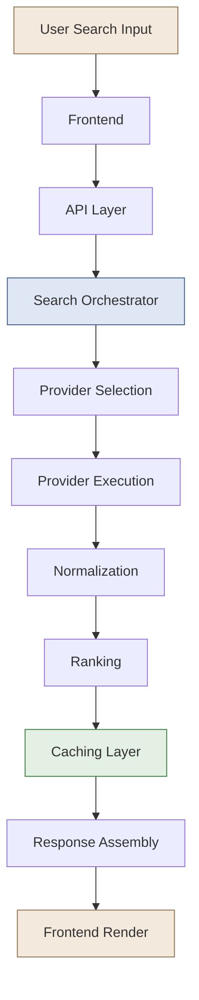
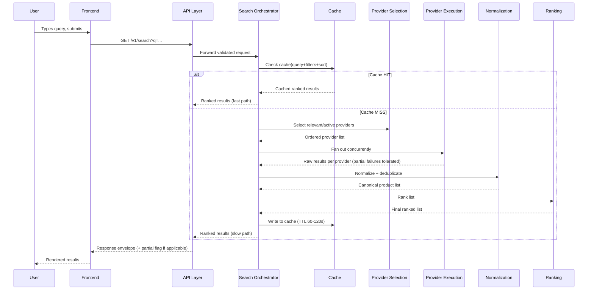

# NexCart (BuyWise) — Search Engine Architecture

**Phase:** 5.3 — Search Engine Design
**Status:** Design/documentation only. No backend implementation included.
**Depends on:** `docs/database.md` (Phase 5.1), `docs/api.md` (Phase 5.2 — specifically `GET /v1/search`)

---

## 0. Scope

This document describes the full lifecycle of a single search request — from the moment a person types a query in the UI, through every internal layer, to the moment ranked results are rendered back. NexCart's core value proposition is aggregation across providers (Amazon, Flipkart, Zepto, Swiggy, etc.), so the search engine's real job isn't "query one database" — it's **fan-out across providers, reconcile the results into one canonical view, rank them fairly, and do it fast enough to feel instant.**

---

## 1. End-to-End Flow (High Level)

Each node above is expanded into its own section below with explicit **inputs, responsibilities, outputs, and failure behavior.**

---

## 2. Layer-by-Layer Responsibilities

### 2.1 User Search (Input Layer)

**Responsibility:** Capture raw human intent — a typed query, a voice-to-text string, or a tapped autocomplete suggestion.

**What it does NOT do:** No validation, no business logic. It is the trigger, not a processing stage.

**Handoff to Frontend:** raw query string + any UI-level filter selections the user has toggled (category chips, price slider) before submitting.

---

### 2.2 Frontend

**Responsibility:**
- Debounce keystrokes (typically 250–400ms) before firing autocomplete requests, to avoid flooding the API on every character.
- Client-side validation: trim whitespace, enforce a minimum query length (≥2 chars) before calling `/v1/search/suggestions`.
- Attach client context to the eventual search request: `sessionId` (always), `userId` (if logged in), device type, current filter state (category, price range, selected providers).
- Optimistic UI: show a loading skeleton immediately, not a blank screen, while the request is in flight.
- On response: render results, and independently fire a fire-and-forget analytics event (`search` type, per `docs/api.md` §9.1) — this must never block the render.

**What it does NOT do:** No ranking, no provider knowledge, no caching decisions. The frontend treats the API as a black box that returns an already-ranked, already-normalized list.

**Handoff to API:** `GET /v1/search?q=...&category=...&minPrice=...&maxPrice=...&providers=...&sort=...`

---

### 2.3 API Layer

**Responsibility:**
- Terminate authentication (attach `userId` if a valid JWT is present, else treat as anonymous per `docs/api.md` §0.2 "Optional" auth level).
- Enforce the validation rules already specified in `docs/api.md` §2.1 (query length, price range sanity, enum checks on `sort`).
- Enforce rate limiting (60 req/min per identity, per §2.1).
- Log the incoming query to `SearchHistory` (async, non-blocking — a slow write here must never delay the response).
- Delegate the actual work to the **Search Orchestrator**; the API layer itself holds no search logic.
- Shape the final response into the standard success/error envelope (`docs/api.md` §0.3/§0.4).

**What it does NOT do:** No provider calls, no ranking math. It's a thin, well-guarded gateway.

**Handoff to Orchestrator:** a normalized internal search request object — `{ query, filters, userId|null, sessionId, requestId }`.

---

### 2.4 Search Orchestrator

**Responsibility — the "brain" of the pipeline:**
- Owns the overall request lifecycle and timeout budget (e.g. a hard 2.5s ceiling for the whole fan-out, so one slow provider can't stall the entire response).
- Decides **whether this query can be served from cache** before doing any real work (see §2.8) — this is the first fork in the flow.
- On a cache miss, decides which downstream stages run and in what order: Provider Selection → Provider Execution → Normalization → Ranking.
- Aggregates partial failures: if 2 of 5 providers time out, the orchestrator still returns results from the 3 that succeeded, tagging the response with a `partial: true` flag rather than failing the whole request.
- Emits internal telemetry per stage (latency per provider, cache hit/miss ratio) for observability — this is architecturally distinct from user-facing `AnalyticsEvents`.

**What it does NOT do:** It doesn't talk to providers directly (that's Provider Execution's job) or compute rankings itself (that's Ranking's job) — it coordinates, it doesn't execute.

**Handoff:** either short-circuits straight to Response Assembly (cache hit) or passes the request to Provider Selection (cache miss).

---

### 2.5 Provider Selection

**Responsibility:**
- Given the query's category/filters, decide **which `Providers` collection entries are even relevant** (e.g. a search for "burger" shouldn't fan out to travel providers; a search for "iPhone" shouldn't hit food-delivery providers).
- Filter out providers where `status: inactive` or `syncStatus: error` (per `docs/database.md` §7) — no point calling a provider whose integration is currently broken.
- Apply the user's explicit provider filter if present in the request (`?providers=amazon,flipkart`), intersected with what's actually relevant/active.
- Rank provider *call order* by historical latency/reliability if the total candidate list is large, so the orchestrator's timeout budget is spent on the providers most likely to respond usefully first.

**Handoff to Provider Execution:** a finalized, ordered list of `providerId`s to query in this request.

---

### 2.6 Provider Execution

**Responsibility:**
- Fan out concurrently (not sequentially) to each selected provider's integration — either a live API call, or a read against NexCart's own pre-synced `Offers` collection if that provider is scrape-based rather than live-API-based.
- Apply a **per-provider timeout** (shorter than the orchestrator's global budget) so one bad actor degrades gracefully instead of blocking everything.
- Retry policy: at most one fast retry on transient network failure per provider, never on a business-logic error (e.g. provider says "no results" — that's not retriable).
- Return each provider's raw, provider-shaped response back up — this layer does **not** attempt to reconcile formats yet.

**What it does NOT do:** No cross-provider comparison, no deduplication — that's explicitly Normalization's job, kept separate so provider integrations can be added/removed without touching business logic elsewhere.

**Handoff to Normalization:** an array of `{ providerId, rawResults[], latencyMs, status: success|timeout|error }`.

---

### 2.7 Normalization

**Responsibility — this is where aggregation actually becomes possible:**
- Map each provider's raw, differently-shaped result into NexCart's canonical shape: a `Products` + `Offers` pair per `docs/database.md` §6/§10 (title, image, price, mrp, stockStatus, deep link).
- **Entity resolution / deduplication**: decide whether "Sony WH-1000XM5 (Black)" from Amazon and "Sony WH1000XM5 Wireless Headphones" from Flipkart are the same underlying `Product`, so they merge into one product card with two `Offers` rather than showing as two separate search results. This is typically done via a combination of brand+model matching, barcode/SKU matching where available, and fuzzy title similarity as a fallback.
- Attach freshness metadata (`lastScrapedAt`) so downstream layers/UI can flag stale offers.
- Discard malformed/incomplete provider results rather than passing bad data forward (e.g. an offer with no price is dropped, logged, not shown).

**Handoff to Ranking:** a clean, deduplicated array of canonical `Product` cards, each with one or more attached `Offers`.

---

### 2.8 Ranking

**Responsibility:**
- Score and order the normalized product list. Ranking factors, roughly in priority order:
  1. Text relevance to the query (title/description match strength).
  2. Requested `sort` override if the user explicitly chose `price_asc`/`price_desc`/`rating` (explicit user intent beats the default relevance model).
  3. Lowest available price across attached offers (default tiebreaker).
  4. `avgRating` / `ratingCount` as a quality signal.
  5. Personalization boost if `userId` is present — mild re-ranking based on `Profiles.preferences.preferredCategoryIds`/`preferredProviderIds` and recent `SearchHistory`, never so strong that it hides objectively better matches.
- Ranking is a **pure function of the normalized list + request context** — it does not re-fetch or re-call anything, keeping it fast and easily unit-testable in isolation.

**Handoff to Caching:** the final ranked array, ready to serve.

---

### 2.9 Caching Layer

**Responsibility:**
- **Read path (checked first, before Provider Selection even runs):** the orchestrator checks cache keyed on a normalized representation of `(query, filters, sort)` — deliberately excluding `userId` from the cache key for the base result set, since raw aggregated results are identical across users; personalization re-ranking (§2.8 point 5) is applied *after* the cache read, on top of the cached base list, so personalization doesn't fragment the cache.
- **Write path:** after Ranking produces a fresh result set, it's written to cache with a short TTL (suggested: 60–120 seconds for high-traffic queries, since provider prices change frequently enough that a long TTL would show stale prices).
- Cache invalidation is **not** attempted eagerly on every price change (too expensive at scale) — short TTL + background offer-sync jobs are the primary freshness mechanism instead of active invalidation.
- On a cache hit, the Orchestrator skips Provider Selection, Provider Execution, and Normalization entirely — this is the single biggest latency win in the whole pipeline, since a live fan-out to 5+ providers is inherently the slowest stage.

**Handoff:** ranked result list (from cache or freshly computed) → Response Assembly.

---

### 2.10 Response Assembly

**Responsibility:**
- Wrap the ranked list into the standard API envelope (`docs/api.md` §0.3), including `meta.page`/`meta.limit`/`meta.total` for pagination.
- Attach the `partial: true` flag and a list of which providers were skipped/failed, if applicable (from §2.4), so the frontend can optionally show "results from 4 of 6 sources."
- This layer is intentionally dumb — formatting only, no decision-making.

---

### 2.11 Frontend Render

**Responsibility:**
- Render the ranked list as received — no client-side re-sorting, since ranking is a server responsibility and must stay consistent across devices/sessions.
- Render a subtle "some sources are temporarily unavailable" notice if `partial: true` is present, rather than silently showing an incomplete list as if it were complete.
- Fire the analytics event for this search completion (result count, latency) as a background call, per `docs/api.md` §9.1.

---

## 3. Cache Hit vs Cache Miss — Sequence Diagram

---

## 4. Failure & Degradation Handling

| Failure scenario | Handling layer | Behavior |
|---|---|---|
| One provider times out | Provider Execution | Excluded from this response; other providers' results still returned; `partial: true` set |
| All providers time out | Orchestrator | Fall back to last-known cached results if available (even if TTL-expired — "stale but something" beats "nothing"); else return `503`-style degraded response with a clear "temporarily unavailable" message |
| Normalization can't confidently dedupe two listings | Normalization | Fail open — show both as separate cards rather than risk merging two genuinely different products |
| Cache layer itself is unavailable | Orchestrator | Treat as a cache miss and proceed with the full live fan-out — cache is a performance optimization, never a hard dependency |
| Malformed provider payload | Provider Execution / Normalization | Dropped and logged, not surfaced to the user as an error |

---

## 5. Data Entities Touched Per Layer

Cross-reference to `docs/database.md`:

| Layer | Entities read | Entities written |
|---|---|---|
| API Layer | Sessions (auth check) | SearchHistory (async log) |
| Provider Selection | Providers | — |
| Provider Execution | Offers (for scrape-based providers) | — |
| Normalization | Products, Brands, Categories | — |
| Ranking | Products (avgRating), Profiles (preferences), SearchHistory (recency signal) | — |
| Caching | — | (external cache store, not a MongoDB collection) |

---

## 6. Performance & Scalability Notes

- **Concurrency over sequence**: Provider Execution must fan out in parallel — a sequential 6-provider call chain at ~500ms each would make every search feel broken (3s+), regardless of how good ranking/normalization are downstream.
- **Cache key design matters more than cache size**: excluding `userId` from the base cache key (per §2.9) is what makes caching effective at all for an aggregator — otherwise every logged-in user fragments the cache into its own copy of near-identical results.
- **The orchestrator's timeout budget is the real SLA**, not any individual provider's speed — this is the layer to tune first if search feels slow in practice.
- **Normalization/entity-resolution quality directly determines perceived result quality** more than ranking sophistication does — a well-ranked list of poorly-deduplicated near-duplicates still feels broken to the user. This is the layer most worth investing engineering time in as NexCart adds more providers.
- **Search is read-heavy and idempotent** — safe to horizontally scale the Orchestrator/Provider Execution layers stateless, with the cache and MongoDB as the only shared state.
